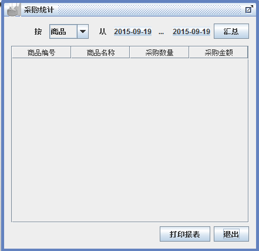

山东理工大学计算机科学与技术学院

**程序设计实训报告**

| 班　　级 |   |
|----------|---|
| 姓　　名 |   |
| 学　　号 |   |
| 指导教师 |   |

二○ 年 月 日

**实训任务书及成绩评定**

| **课题名称** | 进销存系统 |
|--------------|------------|

**Ⅰ、题目的目的和要求**：

进销存（PSS）软件是一款通用性极强的商业企业进销存管理系统，软件囊括了商业企业日常经营管理的全过程。软件适用于食品、服装、保健品、电子、电器、物资、化妆品等商业领域的企业。软件覆盖商业企业商品的采购、销售、库存、管理决策支持等各个环节，软件的各个模块操作界面简单、实用，软件帮助系统图文并茂，让用户可以在最短的时间内掌握软件的使用方法，助用户生意早日更上一层楼。软件的采购管理、销售管理、库存管理功能强大，灵活，同时为用户提供方便实用的模糊查询功能，用户可以在最短时间内找到自己所需要的信息。软件系统采用流行的B/S结构，可以供多台电脑协同工作，数据共享。软件采用模块级安全管理，系统安全性高。软件对在使用过程中可能出现的外部意外情况，如断电、网络中断等均进行了妥善处理，可以确保用户数据的完整性，同时在外部故障消除后，系统仍能继续操作。系统软件采用Java平台进行开发并实现，用户数据选用oracle进行统一管理。

Ⅱ、设计进度及完成情况
=====================

| 日 期 | 内 容                    |
|-------|--------------------------|
|       | 完成环境配置             |
|       | 按照三层架构完成面版功能 |
|       | 改善客户和员工部分       |
|       | 完成采购和销售部分       |
|       | 完成统计部分和报告       |

Ⅲ、主要参考文献及资料
=====================

**Ⅳ、成绩评定**

成绩： （教师填写）

指导老师： （签字）

二○一九年 月 日　　

**目 录**

[第一章 概述 1](#第一章-概述)

[1.1 产品介绍 1](#_Toc12530900)

[1.2 产品面向的用户群体 1](#_Toc12530901)

[1.3 产品应当遵循的标准或规范 1](#_Toc12530902)

[1.4 产品范围 1](#_Toc12530903)

[1.5 产品中的角色 1](#_Toc12530904)

[第二章 系统分析 2](#第二章-系统分析)

[第三章 概要设计 5](#第三章-概要设计)

[第四章 数据库设计 7](#第四章-数据库设计)

[4.1 数据表汇总 7](#_Toc12530908)

[4.2 产品表 7](#_Toc12530909)

[4.3 供应商资料表 7](#_Toc12530910)

[4.4 客户信息表 8](#_Toc12530911)

[4.5 员工表 8](#_Toc12530912)

[4.6 采购表 9](#_Toc12530913)

[4.7 销售表 10](#_Toc12530914)

[第五章 详细设计 11](#第五章-详细设计)

[5.1 业务主界面 11](#_Toc12530916)

[5.2 基本资料管理 11](#_Toc12530917)

[5.3 采购管理 14](#_Toc12530918)

[5.4 销售管理 16](#_Toc12530919)

[5.5 统计查询 18](#_Toc12530920)

[第六章 运行与测试 20](#第六章-运行与测试)

[第七章 总结与心得 23](#第七章-总结与心得)

第一章 概述
===========

1.1 产品介绍

进销存（PSS）软件是一款通用性极强的商业企业进销存管理系统，软件囊括了商业企业日常经营管理的全过程。软件适用于食品、服装、保健品、电子、电器、物资、化妆品等商业领域的企业。软件覆盖商业企业商品的采购、销售、库存、管理决策支持等各个环节，软件的各个模块操作界面简单、实用，软件帮助系统图文并茂，让用户可以在最短的时间内掌握软件的使用方法，助用户生意早日更上一层楼。软件的采购管理、销售管理、库存管理功能强大，灵活，同时为用户提供方便实用的模糊查询功能，用户可以在最短时间内找到自己所需要的信息。软件系统采用流行的B/S结构，可以供多台电脑协同工作，数据共享。软件采用模块级安全管理，系统安全性高。软件对在使用过程中可能出现的外部意外情况，如断电、网络中断等均进行了妥善处理，可以确保用户数据的完整性，同时在外部故障消除后，系统仍能继续操作。系统软件采用Java平台进行开发并实现，用户数据选用oracle进行统一管理。

1.2 产品面向的用户群体

进销存（PSS）主要是帮助商业企业全面有效管理采购、销售和库存，软件适用于需要进行采购管理，销售管理以及库存管理的所有商业企业。

1.3 产品应当遵循的标准或规范

本产品的是一套标准的进销存软件，符合国家财务标准，本产品遵循《计算机软件保护条例》的各项规定。

1.4 产品范围

PSS进销存管理系统是集采购、销售及库存管理于一体的商业企业管理软件系统。本产品适用于商业贸易、批发行业以及个人用户，不适用于零售行业及行业标准较强的行业（如医疗药品的进销存管理）。

1.5 产品中的角色

超级管理员 拥有使用系统所有功能的权限。

普通用户 在拥有相应的权限的情况下，可以维护各种资料，管理采购，销售及库存。

 第二章 系统分析
===================

ELMS进销存软件是一款通用性极强的商业企业进销存管理系统，软件适用于食品、服装、保健品、电子、电器、物资、化妆品等商业领域的企业。软件覆盖商业企业商品的采购、销售、库存、管理决策支持等各个环节。软件的采购管理、销售管理、库存管理功能强大，灵活，同时为用户提供方便实用的模糊查询功能，用户可以在最短时间内找到自己所需要的信息。软件的采购管理、销售管理、库存管理功能强大，灵活，同时为用户提供方便实用的模糊查询功能，用户可以在最短时间内找到自己所需要的信息。软件系统采用流行的B/S结构，可以供多台电脑协同工作，数据共享。软件采用模块级安全管理，系统安全性高。软件对在使用过程中可能出现的外部意外情况，如断电、网络中断等均进行了妥善处理，可以确保用户数据的完整性，同时在外部故障消除后，系统仍能继续操作。系统软件采用Java平台进行开发并实现，用户数据选用MySQL进行统一管理。

下面将通过用例图对系统功能进行分析。

第三章 概要设计
===============

系统的主要功能如下：

| **功能类别**     | **功能名称、标识符** | **描述**                                                                                                                                                             |
|------------------|----------------------|----------------------------------------------------------------------------------------------------------------------------------------------------------------------|
| **用户登录**     | 用户登录             | 对用户输入的用户名，密码进行验证，验证通过后，该用户可以使用PSS系统中自己拥有权限的那部分功能，否则拒绝使用。                                                        |
| **维护基本资料** | 销售员资料维护       | 用户修改，删除，新增或查询销售员数据，系统根据用户的操作，对销售员资料进行更新或显示。                                                                               |
|                  | 商品资料维护         | 用户修改，删除，新增或查询商品数据，系统根据用户的操作，对商品资料进行更新或显示。                                                                                   |
|                  | 客户资料维护         | 用户修改，删除，新增或查询客户数据（其中包括对客户的联系人的修改，删除，新增与查询以及对客户交易记录的查询），系统根据用户的操作，对商品资料进行更新或显示。         |
|                  | 供应商资料维护       | 用户修改，删除，新增或查询供应商数据（其中包括对供应商的联系人的修改，删除，新增与查询以及对供应商交易记录的查询），系统根据用户的操作，对供应商资料进行更新或显示。 |
| **采购**         | 采购入库             | 用户通过录入采购入库单增加采购的货物，并可对采购入库单及其单据中的货物明细进行修改、删除与查询。                                                                     |
|                  | 采购退货             | 用户录入通过采购退货单退回货物，并可对采购退货单及其单据中的货物明细进行修改、删除与查询。                                                                           |
| **销售**         | 销售出库             | 用户通过录入销售出库单记录销售的货物，并可对销售出库单及其单据中的货物明细进行修改、删除与查询。                                                                     |
|                  | 销售退货             | 用户通过录入销售退货单退回已销售货物，并可对销售退货单及其单据中的货物明细进行修改、删除与查询。                                                                     |
| **库存**         | 库存查询             | 用户通过组合不同条件，对库存进行查询、盘点。                                                                                                                         |
| **维护系统**     | 维护用户资料         | 拥有系统维护权限的用户可以增加新用户，并可以对用户的资料进行修改、删除以及查询。                                                                                     |
|                  | 管理用户权限         | 拥有权限管理的用户可以设定其他用户对软件的访问权限。                                                                                                                 |
|                  | 修改密码             | 用户重新设定自己的密码                                                                                                                                               |
| **报表导出**     | 导出库存预警         | 库存量低于安全存量的商品系统向用户提供警示信息，以提醒用户及时进货。用户也可将警示信息导出到Excel中。                                                                |
|                  | 导出商品资料         | 将商品资料信息导出到Excel中。                                                                                                                                        |
|                  | 导出采购报表         | 按日期或用户定义的汇总方式对采购信息进行汇总，并将汇总结果导出到Excel中。                                                                                            |
|                  | 导出年采购报表       | 根据年度汇总采购支出金额，并按月分将其导出在Excel中。                                                                                                                |
|                  | 导出销售报表         | 按日期或用户定义的汇总方式对销售信息进行汇总，并将汇总结果导出到Excel中。                                                                                            |
|                  | 导出年销售报表       | 根据年度汇总销售收入金额，并按月分将其导出在Excel中。                                                                                                                |

 第四章 数据库设计
=====================

>   4.1 数据表汇总

| **表名**     | **说明**         |
|--------------|------------------|
| **Product**  | **产品表**       |
| **Supplier** | **供应商资料表** |
| **Customer** | **客户信息表**   |
| **Employee** | **员工表**       |
| **Purchase** | **采购表**       |
| **Sales**    | **销售表**       |

>   4.2 产品表

Product表字段定义

| **表名**         | Product（产品表）        |             |              |              |
|------------------|--------------------------|-------------|--------------|--------------|
| **列名**         | **数据类型（精度范围）** | **空/非空** | **约束条件** | **说明**     |
| ProductID        | Int                      | 非空        | PK,自增      | 编号         |
| ProductName      | varchar(30)              | 非空        |              | 产品名称     |
| SafeStock        | int                      | 非空        | Defalut:0    | 安全存量     |
| Quantity         | int                      | 非空        | Defalut:0    | 当前数量     |
| SuggestBuyPrice  | decimal(18,2)            | 空          |              | 建议购买价   |
| SuggestSalePrice | decimal(18,2)            | 空          |              | 建议销售价   |
| LastPurchaseDate | date                     | 空          |              | 最后进货日期 |
| LastDeliveryDate | date                     | 空          |              | 最后送货日期 |
| State            | Int                      | 非空        | Default: 1   | 状态         |
| **补充说明**     |                          |             |              |              |

4.3 供应商资料表

Supplier表字段定义

| **表名**         | Supplier（供应商资料表） |             |              |              |
|------------------|--------------------------|-------------|--------------|--------------|
| **列名**         | **数据类型（精度范围）** | **空/非空** | **约束条件** | **说明**     |
| SupplierID       | Int                      | 非空        | PK,自增      | 编号         |
| SupplierName     | varchar(60)              | 空          |              | 供应商全称   |
| Owner            | varchar(30)              | 空          |              | 负责人       |
| job              | varchar(30)              | 空          |              | 负责人称谓   |
| Telephone        | varchar(20)              | 空          |              | 电话         |
| MobilePhone      | varchar(20)              | 空          |              | 移动电话     |
| Fax              | varchar(20)              | 空          |              | 传真         |
| CompanyAddress   | varchar(100)             | 空          |              | 公司地址     |
| FactoryAddress   | varchar(100)             | 空          |              | 工厂地址     |
| LastPurchaseDate | datetime                 | 空          |              | 最后进货日期 |
| State            | Int                      | 非空        | Default :1   | 状态         |
| **补充说明**     |                          |             |              |              |

4.4 客户信息表

Customer表字段定义

| **表名**         | Customer（客户信息表）   |             |              |              |
|------------------|--------------------------|-------------|--------------|--------------|
| **列名**         | **数据类型（精度范围）** | **空/非空** | **约束条件** | **说明**     |
| CustomerID       | Int                      | 非空        | PK 自增      | 编号         |
| CustomerName     | varchar(60)              | 空          |              | 客户名称     |
| TaoBaoID         | varchar(30)              | 空          |              | 客户淘宝号   |
| Telephone        | varchar(20)              | 空          |              | 电话         |
| MobilePhone      | varchar(20)              | 非空        |              | 移动电话     |
| DeliveryAddress  | varchar(100)             | 空          |              | 客户送货地址 |
| LastDeliveryDate | datetime                 | 空          |              | 最后送货日期 |
| State            | Int                      | 非空        | Default:1    | 状态         |
| **补充说明**     |                          |             |              |              |

4.5 员工表

Employee表字段定义

| **表名**     | Employee（员工表）       |             |              |          |
|--------------|--------------------------|-------------|--------------|----------|
| **列名**     | **数据类型（精度范围）** | **空/非空** | **约束条件** | **说明** |
| empID        | Int                      | 非空        | PK,自增      | 编号     |
| empName      | varchar(10)              | 非空        |              | 中文名称 |
| empSex       | varchar(60)              | 非空        |              | 性别     |
| Origin       | Varchar(100)             | 空          |              | 籍贯     |
| Home         | Varchar(100)             | 空          |              | 现住址   |
| phone        | varchar(20)              | 非空        |              | 电话     |
| QQ           | varchar(20)              | 空          |              | QQ号     |
| Wechat       | varchar(50)              | 空          |              | 微信号   |
| State        | Int                      | 非空        |              | 状态     |
| **补充说明** |                          |             |              |          |

4.6 采购表

Pruchase表字段定义

| **表名**          | Purchase（采购表）       |             |              |                    |
|-------------------|--------------------------|-------------|--------------|--------------------|
| **列名**          | **数据类型（精度范围）** | **空/非空** | **约束条件** | **说明**           |
| PurchaseID        | varchar(8)               | 非空        | FK           | 采购单号           |
| ProductID         | varchar(8)               | 非空        | FK           | 产品编号（外键）   |
| PurchaseQuantity  | Int                      | 非空        | Defalut:0    | 数量               |
| PurchaseUnitPrice | decimal(18,2)            | 非空        | Defalut:0    | 单价               |
| totalMoney        | decimal(18,2)            | 非空        | Defalut:0    | 总金额             |
| Supplierid        | Int                      | 非空        |              | 供应商编号（外键） |
| purchaseDate      | Date                     | 非空        |              | 采购日期           |
| returnAmount      | Int                      | 空          |              | 退货数量           |
| returnDate        | Date                     | 空          |              | 退货日期           |
| returnReason      | Varchar(100)             | 空          |              | 退货原因           |
| State             | Varchar                  | 非空        | Default 1    | 状态               |
| **补充说明**      |                          |             |              |                    |

表 2-31 PruchaseDetail表字段定义

4.7 销售表

sales表字段定义

| **表名**       | sales（销售表）          |             |              |                  |
|----------------|--------------------------|-------------|--------------|------------------|
| **列名**       | **数据类型（精度范围）** | **空/非空** | **约束条件** | **说明**         |
| salesID        | Int                      | 非空        | FK,自动增长  | 销售单单号       |
| ProductID      | varchar(8)               | 非空        | FK           | 产品编号（外键） |
| SalesQuantity  | int                      | 非空        | Default:0    | 销售数量         |
| SalesUnitPrice | decimal(18,0)            | 非空        | Default:0    | 销售单价         |
| totalMoney     | decimal(18,0)            | 非空        | Default:0    | 总金额           |
| Customerid     | Int                      | 非空        |              | 客户编号（外键） |
| saleDate       | Date                     | 非空        |              | 销售日期         |
| returnAmount   | Int                      | 空          |              | 退货数量         |
| returnDate     | Date                     | 空          |              | 退货日期         |
| returnReason   | Varchar(100)             | 空          |              | 退货原因         |
| **补充说明**   |                          |             |              |                  |

 第五章 详细设计
===================

5.1 业务主界面

采用多文档窗口模式，每个业务使用一个内部窗体完成，菜单项实现所有需求功能，工具栏属于菜单项的快捷方式

5.2 基本资料管理

在基本资料维护中可以对商品信息、供货商、客户、员工进行设置。

商品资料维护

商品资料是企业经营商品的基本信息，是库存资料的保障。该用例主要维护商品资料信息的各项操作，对商品的增加、删除及修改进行管理。用户可以增加新的商品信息，可以对已有商品资料进行修改，如果某个商品没有其交易记录，那么员工也可以将此商品删除。商品资料主要内容包括商品编号、商品名称、安全存量、当前数量、建议采购价、建议销售价、最后一次采购日期以及最后一次销售日期。

商品资料维护内部窗体

供应商资料维护

供应商是货物的提供者。该用例主要管理供应商资料信息的各项操作，对供应商资料的增加、删除及修改进行管理。员工可以新增和修改供应商资料，如果供应商没有过交易记录，员工可以将此供应商删除。供应商需维护的资料内容包括供应商编号、供应商简称、供应商全称、负责人称谓、负责人姓名、电话、传真、移动电话、供应商地址、工厂地址及最近一次进货日期。供应商的联络资料也是属于供应商资料的一部分，其中包括:中文名称、英文名称、联络人称谓、电话、移动电话。员工还可以查看供应商的交易标志、交易单号、交易日期、总交易金额。

供应商资料维护内部窗体

客户资料维护

客户资料是企业经营的核心，也是销售订单的来源。该用例主要管理客户资料信息的各项操作，对客户资料的增加、删除及修改进行管理。员工可以新增和修改客户资料，如果客户没有过交易记录，员工可以将此客户删除。需维护的客户资料内容包括客户编号、客户全称、负责人称谓、负责人、电话、移动电话、送货地址。客户的联络资料也是属于客户资料的一部分，员工还可以查看客户的交易记录，交易记录主要记载交易单号、交易日期、售货员、送货地址、总交易金额。

客户资料维护内部窗体

员工数据维护

员工在企业中造负责联络客户，将商品销售给客户。该用例主要是用户对企业销售员工的统一管理。企业增加新的销售员工时，用户可以在系统中添加该员工的基本信息，如销售员工资料发生变动，可以对其资料进行修改，对于离职的销售员工可以将其删除，但该销售员工必须没有业务客户。可修改的资料内容包括销售员工编号、中文姓名、英文姓名、电话、移动电话以及联络地址。

员工数据维护内部窗体：

5.3 采购管理

在采购维护中可以对采购入库和采购退货进行设置（员工登录，注意操作员为哪个员工）

采购（已入库）查询

用于对采购记录进行查询，通过时间段，商品名称，供应商名称，或者入库操作员进行查询

采购入库

采购入库是针对某些商品需要进货，从供应商那里购买货物，进货信息可以从现有商品中选择，选择某商品后，该商品自动添加到“加入采购表”，不允许重复增加

填写采购信息，采购数量，采购价格，供应商后选择“采购入库”，所采购的商品加入库存（*当前库存数量＝当前库存数量＋本次进货数量*），并添加采购单信息，记录采购入库时间（当前时间）

在没有选择“采购入库”前，采购信息可以随时修改，这时只是在界面上操作，不涉及数据库操作。

采购退货

用于管理公司的采购退货单，记录商品退货情况。就是针对某次采购可以对该次采购进行退货

首先可以按条件查询采购单信息，列出指定条件下的采购单，如要进行采购退货，选择某采购单，则该采购单信息自动填写到“采购退货”表，不允许重复增加。

在“采购退货表”中，只需要填写退货数量，可以全退，可以部分退，不能超过采购量。选择“采购退货”后，修改采购单，对当前采购单的退货量和退货时间录入数据。同时，更新采购单采购数量，每种商品的库存数量，更新公式为当前库存数量＝当前库存数量－本次退货数量。

采购退货内部窗体

5.4 销售管理

维护销售过程中的销售出库单和销售退货单欠款催收（注意销售员是谁）

销售出库查询

用于对销售出库的商品进行分时间段，关键字进行查询

销售出库

用于录入公司的销售单，并将销售商品出库，有客户购买商品，从商品中选择商品，该商品添加到“加入销售”表，填写销售数量，销售价格和客户，确认信息无误后选择“销售出库”。

所有销售出库的商品库存进行相应的减少，并增加销售出库单，记录销售出库时间，并保证增加销售商品时保证*当前库存数量－该商品在单据上的数量\>=0*。

在没有选择“销售出库”前可以任意修改销售单信息。

销售退货

用于管理公司的销售退货单，记录销售商品退货情况。

首先根据条件查询销售出库单信息，选择指定的销售单，填写退货数量后选择“销售退货”。当前销售单录入退货数量和退货时间。同时，更新销售单销售数量，每种商品的库存数量，更新公式为当前库存数量＝当前库存数量＋本次销售退货单据上的商品数量。

在没有选择“销售退货”前，可以任意修改销售退货单信息。

5.5 统计查询

供应商交易统计(日期段，或年报)

客户交易统计（日期段或年报）

库存查询（当前）

采购汇总

第六章 运行与测试
=================

 第七章 总结与心得
=====================

通过本次课程设计，我加深了对软件开发流程的深入理解。这是一次严格的按照软件工程开发的标准开发项目。在课程设计过程中，认真编写软件开发文档和程序代码。代码编写完后，再认真测试，检查系统的不足之处。由于之前开发系统都没有编写软件开发文档的习惯，因此，在编写软件开发文档的过程中遇到了一些问题，但是通过查阅资料等途径解决了。通过本次课程设计，我深刻体会到软件工程文档编写的重要性，软件工程文档是指导我们进行项目开发的指挥棒。编写好一份高效可行的软件工程文档对软件开发非常重要。还有，对系统的需求分析非常重要，需求的变成直接影响项目的开发进度。这次课程设计首先对系统的需求理解不透彻，走了一点弯路，浪费了一些时间。在以后的软件开发过程中尽量吸取本次课程设计的经验教训，提高项目开发效率。
