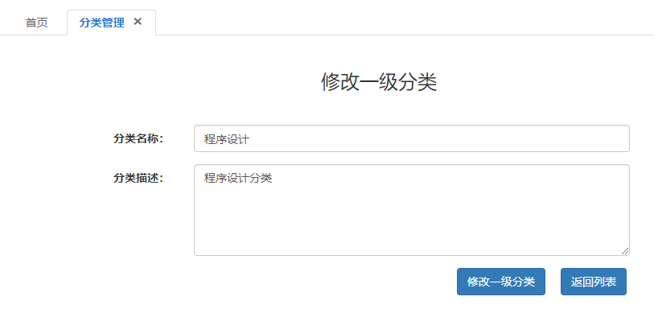
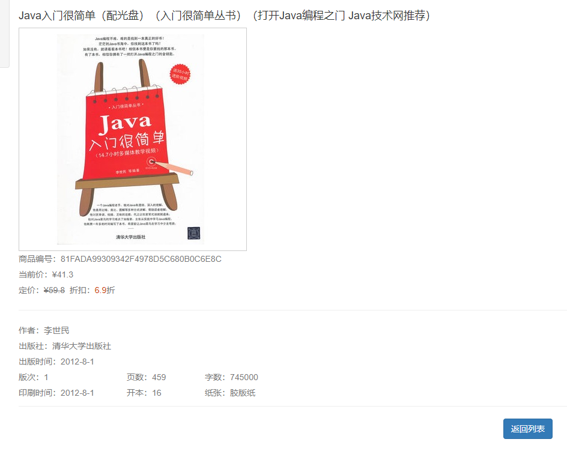

**实训任务书及成绩评定**

| **课题名称** | 网上书城系统 |
|--------------|--------------|

**Ⅰ、题目的目的和要求**：

网上书城是一款适用人群非常普遍的在线购书系统。在未来，网上购书在我国的经济中所占的比例会越来越大。网上购书以计算机网络作为数据传播手段，在任何地点、任何时间为用户提供购书的可能，其快捷方便、无所不在的特点使得网上购书越来越受到商家和消费者的青睐，同时网上书城也为商家扩展市场打下了坚实的基础。

Ⅱ、设计进度及完成情况
=====================

| 日 期   | 内 容                        |
|---------|------------------------------|
| 7.1     | 完成环境配置                 |
| 7.2-7.5 | 完成分类添加，修改，删除功能 |
| 7.8-7.9 | 完成图书添加，修改，删除功能 |
| 7.10    | 完成订单添加，修改，删除功能 |
| 7.11    | 项目功能完整测试             |

Ⅲ、主要参考文献及资料
=====================

**Ⅳ、成绩评定**

成绩： （教师填写）

指导老师： （签字）

二○一九年 月 日　　

**目 录**

[第一章 需求分析 1](#第一章-需求分析)

[1.1 系统概述 1](#_Toc13649276)

[1.2用户主体 1](#_Toc13649277)

[第二章 系统分析 2](#第二章-系统分析)

[2.1实体设计 2](#_Toc13649279)

[2.2前台功能设计 3](#_Toc13649280)

[第三章 关系和数据库设计 4](#第三章-关系和数据库设计)

[3.1关系设计 4](#_Toc13649282)

[3.2数据库设计 4](#_Toc13649283)

[第四章 详细设计 7](#第四章-详细设计)

[4.1后台功能设计 7](#_Toc13649285)

[第五章 运行与测试 14](#第五章-运行与测试)

[第六章 总结与心得 16](#第六章-总结与心得)

第一章 需求分析
===============

1.1 系统概述

网上书城系统是典型的网上购物实践中最为普遍的电子商务企业对客户（B2C）模式，主要包括会员注册、订单管理、购物车、搜索、支付等基本功能。此外，本系统也将实现在线图书销售系统的后端管理，包括图书的添加、订单的处理等功能。

网上书城系统主要功能如下：

（1）前台（客户购买）部分：

① 用户管理：注册会员、登录、激活、退出、修改密码；

② 分类显示：显示所有1级和2级分类；

③
图书显示：按分类查询图书、通过关键字搜索图书、高级搜索图书、查看某本图书的详细等；

④
购物车管理：向购物车中添加图书、修改购物车中图书数量、删除购物车中图书、我的购物车；

⑤
订单管理：通过购物车中图书生成订单、查看我的订单、查看某个订单的详细、订单支付、确认收货、取消未付款订单。

（2）后台（管理员管理）部分：

① 管理员：管理员登录；

②
分类管理：查看所有分类、添加1级分类、添加2级分类、修改1级分类、修改2级分类、删除1级分类、删除2级分类；

③
图书管理：按分类搜索图书、高级搜索图书、添加新图书、查看图书详细信息、编辑图书、删除图书；

④ 订单管理：按状态搜索订单、查看订单详细信息、取消订单、发货；

1.2用户主体

| **角色名称** | **职责描述**                                                             |
|--------------|--------------------------------------------------------------------------|
| 管理员       | 拥有使用系统所有功能的权限。（管理图书、订单等）                         |
| 普通用户     | 在拥有相应的权限的情况下，可以浏览、查询、购买图书；管理个人信息和订单。 |

 第二章 系统分析
===================

2.1实体设计

根据设计规划的主要实体有：用户、图书分类、图书、购物车、订单、管理员。各个实体具体的描述属性图如下（实体属性在下图中并没有全部给出，因为属性过多的原因）：

用户实体

图书分类实体

图书实体

购物车实体

>   购物车其实是购物项的集合。即多个购物项构成了购物车。

订单实体

>   订单其实是订单项的集合。即多个订单项构成了订单。

2.2前台功能设计

第三章 关系和数据库设计
=======================

3.1关系设计

1、用户VS订单 --》 一对多对应关系

2、商品小类VS 商品 --》 一对多对应关系

3、商品大类VS商品 --》 一对多对应关系

4、商品大类VS商品小类 --》 一对多对应关系

5、商品 VS 订单 --》 多对多对应

由于我们需要加一些业务逻辑，比如某个订单的每个商品数量，这个数量业务字段，
我们一般设计都是在加第三张关联表里的。Hibernate
本身支持多对多的。但是根据我们的业务逻辑，我们需要把这个设计成两个一对多。 即

商品实体 VS 订单商品关系实体 --》 一对多对应关系

订单实体 VS 订单商品关系实体 --》 一对多对应关系

3.2数据库设计

1.  管理员表（t_admin）

| **字段名称** | **类型**    | **是否为空** | **约束** | **备注**       |
|--------------|-------------|--------------|----------|----------------|
| adminId      | char(32)    | 否           | 主键     | 管理员编号     |
| adminname    | varchar(50) | 是           |          | 管理员登录账号 |
| adminpwd     | varchar(50) | 是           |          | 管理员登录密码 |

2.  用户表(t_user)

| **字段名称**   | **类型**    | **是否为空** | **约束** | **备注** |
|----------------|-------------|--------------|----------|----------|
| uId            | char(32)    | 否           | 主键     | 用户编号 |
| loginname      | varchar(50) | 是           | 唯一     | 登录名   |
| loginpass      | varchar(50) | 是           |          | 登录密码 |
| email          | varchar(50) | 是           |          | 邮箱     |
| status         | tinyint(1)  | 是           |          | 状态     |
| activationCode | char(64)    | 是           |          | 激活码   |

3.  图书分类表(t_category)

| **字段名称** | **类型**     | **是否为空** | **约束**  | **备注** |
|--------------|--------------|--------------|-----------|----------|
| cid          | char(32)     | 否           | 主键      | 分类编号 |
| cname        | varchar(50)  | 是           | 唯一      | 分类名称 |
| pid          | char(32)     | 是           | 外键      | 父分类   |
| desc         | varchar(100) | 是           |           | 分类描述 |
| orderBy      | int(11)      | 否           | 普通 自增 | 排序     |

4.  图书表(t_book)

| **字段名称** | **类型**     | **是否为空** | **约束**  | **备注**     |
|--------------|--------------|--------------|-----------|--------------|
| bid          | char(32)     | 否           | 主键      | 图书编号     |
| bname        | varchar(200) | 是           |           | 图书名称     |
| author       | varchar(50)  | 是           |           | 作者         |
| price        | decimal(8,2) | 是           |           | 定价         |
| currPrice    | decimal(8,2) | 是           |           | 当前价       |
| discount     | decimal(3,1) | 是           |           | 折扣         |
| press        | varchar(100) | 是           |           | 出版社       |
| publishtime  | char(10)     | 是           |           | 出版时间     |
| edition      | int(11)      | 是           |           | 版次         |
| pageNum      | int(11)      | 是           |           | 页数         |
| wordNum      | int(11)      | 是           |           | 字数         |
| printtime    | char(10)     | 是           |           | 刷新时间     |
| booksize     | int(11)      | 是           |           | 开本         |
| paper        | varchar(50)  | 是           |           | 纸质         |
| cid          | char(32)     | 是           | 外键      | 二级分类编号 |
| image_w      | varchar(100) | 是           |           | 大图路径     |
| image_b      | varchar(100) | 是           |           | 小图路径     |
| orderBy      | int(11)      | 否           | 普通 自增 | 一级分类编号 |

5.  购物车表(t_cartitem)

| **字段名称** | **类型** | **是否为空** | **约束**  | **备注**       |
|--------------|----------|--------------|-----------|----------------|
| cartItemId   | char(32) | 否           | 主键      | 编号           |
| quantity     | int(11)  | 是           |           | 数量           |
| bid          | char(32) | 是           | 外键      | 条目对应的图书 |
| uid          | char(32) | 是           | 外键      | 所属用户       |
| orderBy      | int(11)  | 否           | 普通 自增 | 当前价         |

6.  订单表（t_order）

| **字段名称** | **类型**      | **是否为空** | **约束** | **备注**                                                                                            |
|--------------|---------------|--------------|----------|-----------------------------------------------------------------------------------------------------|
| oid          | char(32)      | 否           | 主键     | 订单编号                                                                                            |
| ordertime    | char(19)      | 是           |          | 下单时间                                                                                            |
| total        | decimal(10,2) | 是           |          | 总计                                                                                                |
| status       | int(11)       | 是           |          | 订单状态：1未付款 2已付款但未发货 3已发货未确认收货 4确认收货了交易成功 5已取消(只有未付款才能取消) |
| address      | varchar(255)  | 是           |          | 排序                                                                                                |
| uid          | char(32)      | 是           | 外键     | 用户编号                                                                                            |

7.  订单项表（t_orderitem）

| **字段名称** | **类型**     | **是否为空** | **约束** | **备注**       |
|--------------|--------------|--------------|----------|----------------|
| orderItemId  | char(32)     | 否           | 主键     | 订单项编号     |
| quantity     | int(11)      | 是           |          | 数量           |
| subtotal     | decimal(8,2) | 是           |          | 小计           |
| bid          | char(32)     | 是           |          | 条目对应的图书 |
| bname        | varchar(200) | 是           |          | 图书名         |
| currPrice    | decimal(8,2) | 是           |          | 当前价         |
| image_b      | varchar(100) | 是           |          | 小图路径       |
| oid          | char(32)     | 是           | 外键     | 所述的订单     |

第四章 详细设计
===============

>   4.1后台功能设计

后台功能实现

书城后台的设计是为管理员方便管理系统而设计的，其中包括分类管理、图书管理，以及订单管理。

管理员登录

后台管理员登录页面，登录成功后到达后台主页。

后台主页

管理员登录成功后，到达主页。主页是框架页，由上、下两部分构成。

上部显示标题和菜单，分别为：“分类管理”、“图书管理”、“订单管理”，以及当前用户名称；

中部默认显示欢迎使用。

分类管理

分类列表

当点击首页上部的“分类管理”链接到达分类列表页面。

添加分类

在分类列表页面中有“添加一级分类”链接，点击该链接直接“添加一级分类页面”。

列表中每个一级分类后面都存在“添加二级分类”链接，添加可以到达“添加二级分类页面”。

　　添加二级分类需要指定父分类。

修改分类

在分类列表中，每个一级分类，以及二级分类后都存在“修改”链接。点击一级分类后的“修改”链接进入“修改一级分类页面”；点击二级分类后的“修改”链接进入“修改二级分类页面”。

删除分类

在分类列表中，每个一级分类，以及二级分类后都存在“删除”链接。点击一级分类后的“删除”链接完成删除一级分类；点击二级分类后的“删除”完成删除二级分类。

注意，如果一级分类下存在子分类，那么不能删除。

注意，如果一级分类下存在图书，那么不能删除。

图书管理

后台图书管理这一部分，很多地方都与前台的图书操作相同，例如：分页显示所有图书、按分类查询图书、高级查询图书、查看图书详细信息。后台图书管理还包括前台所没有的功能，例如：添加新图书、编辑和删除图书。

图书列表页面

点击“图书管理”链接会到达图书列表页面。该页面会分页显示所有图书信息！显示“添加图书”和“高级查询”两项功能

添加图书

点击“图书管理”链接后，在中部会出现“添加图书”链接，点击后会进入添加图书表单页面。

　　表单使用了JQuery进行校验，如果校验无误，添加图书会成功！

图书详细

　　在图书列表中点击某一本图书后会进入图书详细页面。

修改图书

图书列表页面上方有一个名为“修改”，进行修改图书信息。

删除图书

在图书列表中，每个图书信息都存在“删除”链接。点击一级分类后的“删除”链接完成删除

注意，如果一级分类下存在子分类，那么不能删除。

订单管理

订单列表

点击“订单管理”链接会到达订单列表页面。该页面会分页显示所有订单！

订单列表页面上包含按状态查询的链接，分别为：未付款、已付款、已发货、交易成功、已取消，管理员可以点击这几个链接按状态查询显示订单。

订单详细

在订单列表页面中，点击某个订单后面的：查看、取消、发货链接会进入到订单详细页面。订单详细页面会显示当前订单的信息，而且会根据点击的链接显示不同的按钮。

　　点击发货或取消按钮完成相应操作即可。

第五章 运行与测试
=================

第六章 总结与心得
=================

通过本次课程设计，我加深了对软件开发流程的深入理解。这是一次严格的按照软件工程开发的标准开发项目。在课程设计过程中，认真编写软件开发文档和程序代码。代码编写完后，再认真测试，检查系统的不足之处。由于之前开发系统都没有编写软件开发文档的习惯，因此，在编写软件开发文档的过程中遇到了一些问题，但是通过查阅资料等途径解决了。通过本次课程设计，我深刻体会到软件工程文档编写的重要性，软件工程文档是指导我们进行项目开发的指挥棒。编写好一份高效可行的软件工程文档对软件开发非常重要。还有，对系统的需求分析非常重要，需求的变成直接影响项目的开发进度。这次课程设计首先对系统的需求理解不透彻，走了一点弯路，浪费了一些时间。在以后的软件开发过程中尽量吸取本次课程设计的经验教训，提高项目开发效率。
